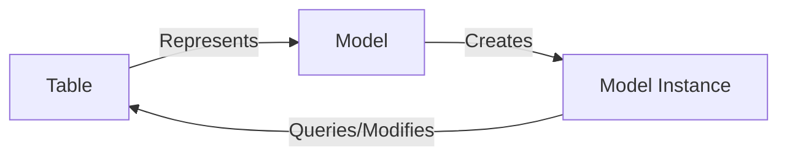
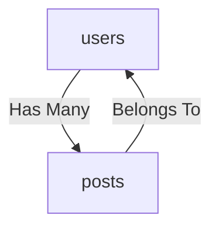

# Introduction to PyLite
PyLite offers a straight-forward Object Relational Mapper (ORM) implementation for SQLite databases. It is designed to be lightweight and easy to use – offering a decidedly more Pythonic interface than the standard sqlite3 module.

## Installation
PyLite is available on PyPI. The latest stable version can be installed using pip:

```bash
pip install pylite
```

The installation process will also install `colorama`, which is prettifying debug messages.

## Introduction to the Fundamentals
PyLite is designed to be used in a similar fashion to Laravel's Eloquent ORM. If you are familiar with Eloquent, the learning curve 
for PyLite should be minimal.

In essence, PyLite is a wrapper around the standard sqlite3 module that provides abstractions for the often-laborious task of interfacing with databases. The hope is that you won't be writing any SQL queries anymore.

To understand how PyLite works, we'll need to cover a basic concept that enables PyLite to work its magic: models, instances, and relationships.

### Models and Instances
A model is a class that represents a database table. For example, consider a database with a `users` table, with each row representing a user. A model simply provides an interface for interacting with the `users` table directly from Python.

Typically, a model's name will follow the singular form of the table name, so in the case of our `users` table, the model class would be named `User`. 



An instance of the model class represents a single row in the table -- in this example, a single user. Fundamentally, the instance provides an interface for querying and modifying the row.

#### What does this look like?
Consider our example of a `User` model representing a `users` table.

Let's say the `users` table looks like this:
| id | name | email |
|----|------|-------|
| 1  | Alice | a@email.com |
| 2  | Bob  | b@email.com |
| 3  | Carol| c@email.com |

Let's examine the simple task of pulling the first user's name and email. Using the sqlite3 module, you might write something like this:
```python
sqlite3.execute("SELECT name, email FROM users WHERE id = 1")
result = sqlite3.fetchone()
result[0] # Alice
result[1] # a@email.com
```

Using PyLite model, you could write:
```python
alice = User.find(1)
alice.name # Alice
alice.email # a@email.com
```
Don't worry if you don't understand the syntax yet, (we'll cover it soon,) but hopefully you can see how much more readable the PyLite version is. That's the beauty of models, and as your commands become more complex, improvements to readability will become increasingly apparent.

### Relationships
In order to effectively utilize PyLite's relationship features, it's important to possess a basic understanding of database relationships. Although this is outside of the scope of this documentation, we'll cover a few basic concepts here.

Relationships are a way of linking models together. For example, consider a `posts` table, with each row representing a post. Each post belongs to a user, so the `posts` table has a `user_id` column that references the `id` column of the `users` table.

The general relationship between the `users` and `posts` tables can be visualized:



This common relationship is referred to as a "one-to-many" relationship. In this case, a user can have many posts, but a post can only belong to one user.

Let's take a peek inside these two tables. We can see that they have the following attributes:
| users | posts |
|-------|-------|
| id | id |
| name | user_id |
| email | title |
| | body |

Now, let's dig into some data. Carol has written two posts, and Bob has written one post.

