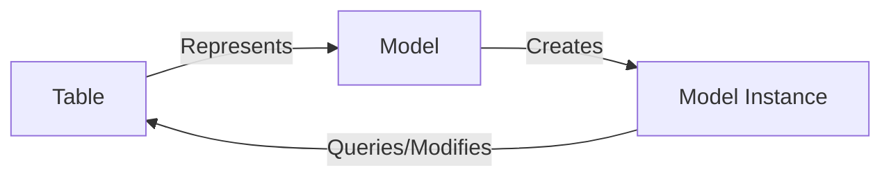

# Introduction to PyLite
PyLite offers a straight-forward Object Relational Mapper (ORM) implementation for SQLite databases. It is designed to be lightweight and easy to use – offering a decidedly more Pythonic interface than the standard sqlite3 module.

## Installation
PyLite is available on PyPI. The latest stable version can be installed using pip:

```bash
pip install pylite
```

The installation process will also install `colorama`, which is prettifying debug messages.

## Introduction to the Fundamentals
PyLite is designed to be used in a similar fashion to Laravel's Eloquent ORM. If you are familiar with Eloquent, the learning curve 
for PyLite should be minimal.

In essence, PyLite is a wrapper around the standard sqlite3 module that provides abstractions for the often-laborious task of interfacing with databases. The hope is that you won't be writing any SQL queries anymore.

To understand how PyLite works, we'll need to cover a few basic concepts that enable PyLite to work its magic:
- Models and Instances
- Collections
- Query Builders

### Models and Instances
A model is a class that represents a database table. For example, consider a database with a `users` table, with each row representing a user. A model simply provides an interface for interacting with the `users` table directly from Python.

Typically, a model's name will follow the singular form of the table name, so in the case of our `users` table, the model class would be named `User`. 



An instance of the model class represents a single row in the table -- in this example, a single user.


